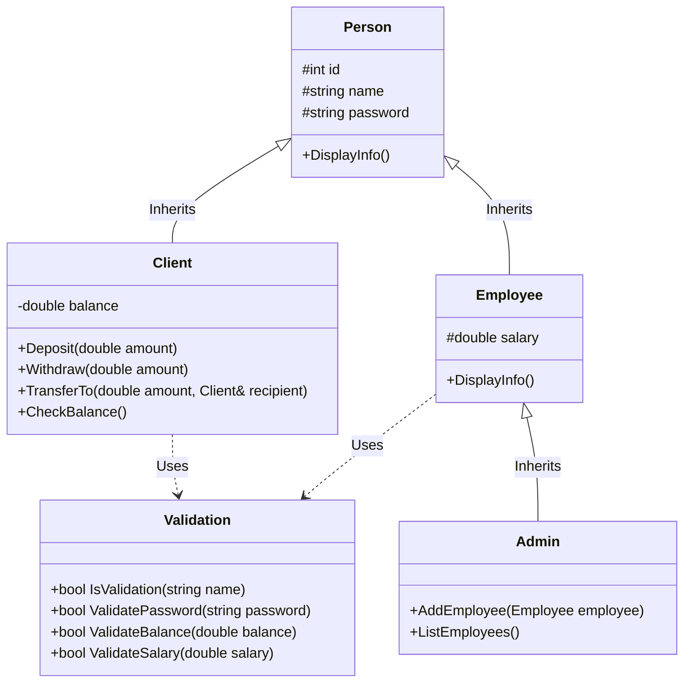

<div align="center">

# 🏦 Bank_System
### Object-Oriented Banking & Client Account Management System in Modern C++

[](https://en.cppreference.com/)
[](#-system-architecture)
[](https://visualstudio.microsoft.com/)
[](LICENSE)
[](https://github.com/OmarAlfar0uk)

<p align="center">
  <a href="#-key-features">Key Features</a> •
  <a href="#-class-hierarchy--oop-architecture">OOP Architecture</a> •
  <a href="#-getting-started">Getting Started</a> •
  <a href="#-author">Author</a>
</p>

</div>

---

## 📌 Executive Overview

**Bank_System** is a robust, console-based banking management software implemented in modern C++. Built to demonstrate clean **Object-Oriented Programming (OOP)** principles—including inheritance hierarchies, encapsulation, abstraction, and polymorphism—it simulates real-world retail banking operations: client account lifecycle management, deposits, withdrawals, fund transfers, and administrative privilege escalation.

> [!NOTE]
> Implements a dedicated **`Validation`** subsystem enforcing strict constraints on client names, password complexity, minimum balance thresholds, and employee salaries.

---

## ✨ Key Features

| ⚡ Feature | 💡 Description | 🛠 Implementation Detail |
|---|---|---|
| **👥 Multi-Tier User Hierarchy** | Granular segregation between Clients, Employees, and Admins | Multi-level inheritance: `Person` → `Client`, `Person` → `Employee` → `Admin` |
| **💰 Financial Transactions** | Balance queries, secure deposits, withdrawals & transfers | Concurrency-safe balance updates with boundary checks |
| **🛡️ Input Validation Engine** | Centralized string and numerical validation rules | Dedicated `Validation` class verifying names, passwords, and balances |
| **⚡ Native Performance** | Compiled with C++20 for optimal execution speed | Memory-safe pointers, references, and standard library algorithms |

---

## 🏛 Class Hierarchy & OOP Architecture



---

## ⚡ Tech Stack

- **Language:** C++20 (ISO/IEC 14882:2020)
- **Compiler:** MSVC (Visual Studio 2022) / GCC / Clang
- **Paradigm:** Object-Oriented Programming (OOP) & Clean Code

---

## 🚀 Getting Started

### Prerequisites
- Visual Studio 2022 (with Desktop Development with C++) or `g++` / `clang++` compiler.

### Build and Run

#### Using Visual Studio
1. Clone the repository:
   ```bash
   git clone https://github.com/OmarAlfar0uk/Bank_System.git
   cd Bank_System
   ```
2. Open `Bank_system/Bank_system.sln` in Visual Studio.
3. Select **Release** or **Debug** with target **x64**.
4. Press `Ctrl + F5` to build and run the application.

#### Using GCC / G++ (CLI)
```bash
g++ -std=c++20 Bank_system/Bank_system.cpp -o BankSystem
./BankSystem
```

---

## 👨‍💻 Author

**Omar Alfarouk**  
*Full-Stack .NET & Software Engineer*  

- 🌐 **GitHub:** [@OmarAlfar0uk](https://github.com/OmarAlfar0uk)
- 💼 **LinkedIn:** [omar-alfarouk](https://www.linkedin.com/in/omar-alfarouk-252471251/)
- 📧 **Email:** [omaralfarouk646@gmail.com](mailto:omaralfarouk646@gmail.com)

---

<div align="center">
  <sub>Built with ❤️ by Omar Alfarouk. Licensed under the <a href="LICENSE">MIT License</a>.</sub>
</div>
